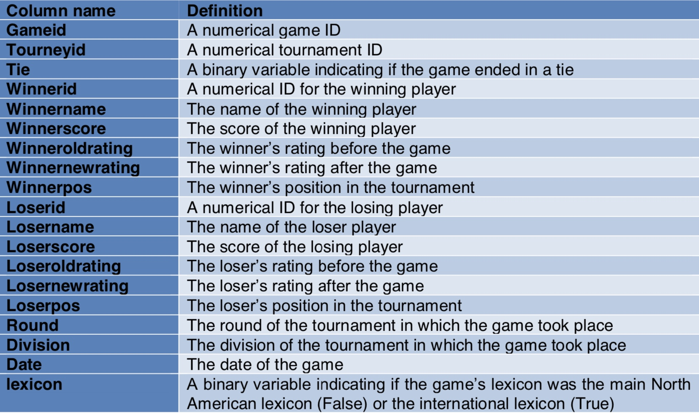

#  Scrabble Games

## Description
The goal of this project is to design the schema of an HBase table and develop a Java program that implements a set of queries on that HBase table. The table, called ScrabbleGames, stores information of a scrabble tournament (http://www.cross-tables.com/). The ScrabbleGames table stores this information according to https://github.com/fivethirtyeight/data/tree/master/scrabble- games:

Please unzip the csv file before running.

Query1: Returns all the opponents (Loserid) of a given Winnername in a tournament (Tourneyid).

Query2: Returns the ids of the players (winner and loser) that have participated more than once in all tournaments between two given Tourneyids.

Query3: Given a Tourneyid, the query returns the Gameid, the ids of the two participants that have finished in tie.

